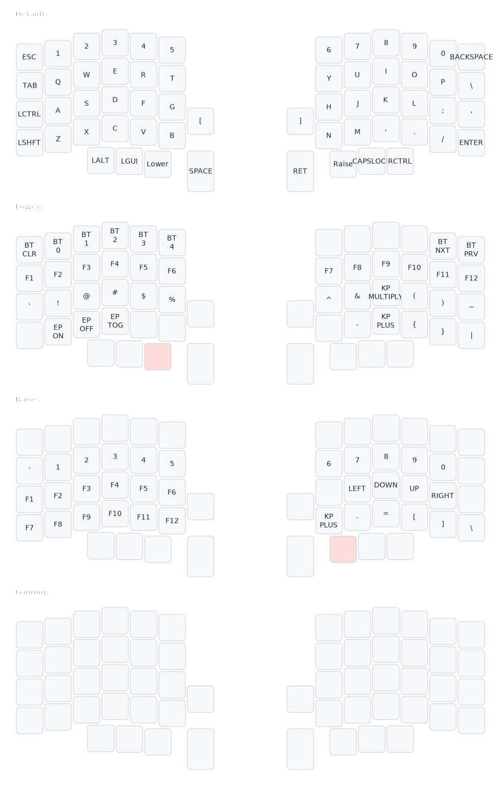

# ZMK config
This is my personal ZMK config for my wireless Lily58 Pro.

### Components:
* Lily58 Pro RGBs
* MT3 /dev/tty keycaps
* nice!nano V2 controllers
* Kailh White Owl V2 Switches

### Keymap layout

Graphic produced with [@caksoylar/keymap-drawer][1]

[1]: https://github.com/caksoylar/keymap-drawer
